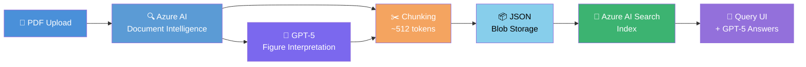

# Document Intelligence Pipeline on Azure

> Upload a PDF. Get structured, queryable knowledge back — powered by Azure AI.

**This repo is a ready-to-use AI prompt** that instructs any coding assistant to build a complete document intelligence pipeline on Azure. Hand it to GitHub Copilot, Claude Code, Cursor, or Windsurf and watch it scaffold the entire system: extraction, chunking, indexing, and a query UI — deployable in under 30 minutes.

It ships as an [APM](https://github.com/microsoft/apm) package so you can install it as a versioned dependency in any project.

---

## The problem it solves

Organizations sit on mountains of complex PDFs — reports, manuals, contracts — full of tables, charts, and figures that are effectively unsearchable. Traditional search can't understand a bar chart or a multi-column table.

This pipeline turns every page, table, and infographic into indexed, queryable chunks. Users upload a PDF and immediately ask questions grounded in its actual content.

---

## How it works



**Stage 1 — Extract** · Azure AI Document Intelligence pulls out text, tables, reading order, and layout. Detected figures are cropped and sent to GPT-5 for visual interpretation.

**Stage 2 — Chunk** · All content (including figure descriptions) is split into ~512-token overlapping chunks. Tables and figure captions are kept intact — never split mid-content.

**Stage 3 — Store** · Chunks are written as structured JSON to Azure Blob Storage, creating an auditable intermediate artifact.

**Stage 4 — Index** · Each chunk is pushed into Azure AI Search, making the full document instantly queryable.

**Stage 5 — Query** · A web UI lets users ask natural-language questions and get grounded answers backed by the indexed content and GPT-5.

---

## Azure services used

| Service | Role |
|---|---|
| **Azure AI Document Intelligence** | Extract text, tables, reading order, and figures from PDFs |
| **Azure AI Foundry + GPT-5** | Interpret figures/infographics; power the query layer |
| **Azure Blob Storage** | Store raw PDFs and intermediate JSON chunks |
| **Azure AI Search** | Index all chunks for fast, grounded retrieval |
| **Azure App Services** | Host the front-end web app |

All infrastructure is defined in Bicep for fully repeatable deployments.

---

## Quick start

### Option A: Install with APM (recommended)

[APM](https://github.com/microsoft/apm) (Agent Package Manager) lets you declare AI agent instructions as versioned dependencies — like `npm install` but for prompts and agent context.

```bash
# Install APM
brew install microsoft/apm/apm        # macOS
pip install apm-cli                    # Python (cross-platform)
```

```bash
# Install this prompt into your project
apm install M2LabOrg/document-intelligence-pipeline
```

Or declare it in your project's `apm.yml`:

```yaml
packages:
  - M2LabOrg/document-intelligence-pipeline
```

Then run `apm install`. APM pulls `.instructions.md` into your agent's context — no manual copy-pasting needed.

### Option B: Direct copy-paste

1. Open [`initial-prompt.md`](./initial-prompt.md)
2. Copy the full contents
3. Paste into your AI coding assistant (GitHub Copilot, Claude, Cursor, Gemini, etc.)
4. Review the generated spec, then ask the assistant to produce code and Bicep files

---

## What you get

The prompt instructs your AI assistant to produce — in order:

1. **Manifesto** — what the system is and why it exists
2. **Auditor description** — plain-English data-flow explanation
3. **Architecture diagram** — full pipeline visualization
4. **Development plan** — ordered build steps
5. **Threat model** — risks and mitigations for data in transit, storage, API exposure, and untrusted uploads
6. **Working code** — Flask/React front end, processing pipeline, and Bicep infrastructure

This spec-first approach means you review the design *before* a single line of code is written.

---

## Prompt engineering techniques demonstrated

| Technique | How it appears |
|---|---|
| **Vibe prompting** | Intent and tone set clearly; the AI infers sensible defaults |
| **Structured specificity** | Exact JSON schema, file-size limits, Bicep folder layout |
| **Spec-first thinking** | Manifesto + threat model required before any code |
| **Deferral as a tool** | Out-of-scope items named explicitly to prevent over-engineering |
| **Constraint clarity** | PDF-only, 20 MB limit, 30-minute deployment target |

---

## Repo structure

```
.
├── apm.yml              # APM package manifest
├── .instructions.md     # Prompt in APM-standard instructions format
├── initial-prompt.md    # Same prompt, standalone human-readable version
└── README.md
```

---

## Is this safe to be public?

Yes. This repo contains only a generic, technology-level prompt — no credentials, API keys, secrets, subscription IDs, or organization-specific data. If you fork and add environment-specific details, keep them in `.env` and add it to `.gitignore`.

---

## Contributing

Pull requests welcome — especially improvements to the prompt (better constraints, alternative chunking strategies, additional deferral items). Open an issue if you adapt this for a different cloud provider.

## License

MIT
